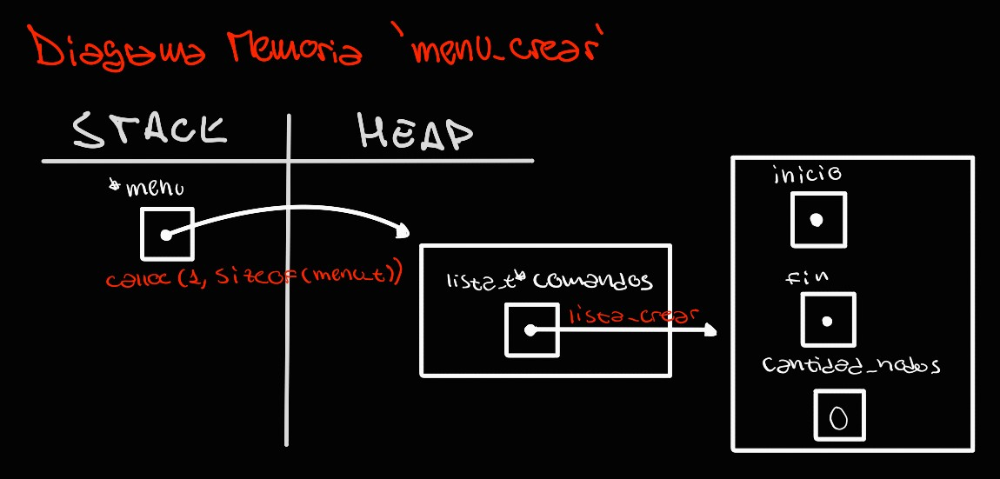

<div align="right">

</div>

# TP2

## Repositorio de John O'Connor - 110102 - johnoc1712@gmail.com

- Para compilar:

```bash
Compilar TP2: gcc -std=c99 -Wall -Wconversion -Wtype-limits -pedantic -Werror -O0 -g tp2.c TDAs/*.c src/*.c -o tp2
Compilar pruebas TDA MENÚ: gcc -std=c99 -Wall -Wconversion -Wtype-limits -pedantic -Werror -O0 -g src/*.c TDAs/*.c pruebas_alumno.c -o pruebas_alumno
Compilar TP1: gcc src/*.c pruebas_chanutron.c -std=c99 -Wall -Wconversion -Wtype-limits -pedantic -Werror -O2 -g -o pruebas_chanutron
```

- Para ejecutar:

```bash
Ejecutar TP2: ./tp2
Ejecutar pruebas TDA MENÚ: ./pruebas_alumno
Ejecutar pruebas cátedra TP1: ./pruebas_chanutron
```

- Para ejecutar con valgrind:

```bash
Ejecutar con valgrind TP2: valgrind --leak-check=full --track-origins=yes --show-reachable=yes --error-exitcode=2 --show-leak-kinds=all ./tp2
Ejecutar con valgrind pruebas TDA MENÚ: valgrind --leak-check=full --track-origins=yes --show-reachable=yes --error-exitcode=2 --show-leak-kinds=all ./pruebas_alumno
Ejecutar con valgrind pruebas cátedra TP1: valgrind --leak-check=full --track-origins=yes --show-reachable=yes --error-exitcode=2 --show-leak-kinds=all ./pruebas_chanutron
```
---
##  Funcionamiento

**TDA MENU**

El desarrollo del TDA MENÚ, utiliza como estructura a `menu_t`, la cual contiene una lista `lista_t` de los comandos que estarán disponibles en el menú. Los elementos de la lista estarán definidos por el struct `comando_t`, cuyos campos permiten guardar el nombre del comando, su instrucción(el caracter o string que ejecuta el comando), una descripción de su función, la función que ejecuta y un parámetro auxiliar de contexto.

En primer lugar se crea un nuevo menú mediante la función `menu_crear`. Esta reserva espacio en memoria dinámica suficiente para toda la estructura del menú. Este proceso se vé representado en el siguiene diagrama:



A partir del menú creado, se pueden realizar las siguientes operaciones: agregar un comando al menú (`menu_agregar_comando`), ejecutar un comando ya agregado al menú (`menu_ejecutar_comando`), verificar si el menú contiene un comando dado (`menu_contiene_comando`), obtener un comando existente en el menú (`menu_obtener_comando`), verificar si el menú está vacío o no (`menu_vacio`), obtener la cantidad de comandos dentro del menú (`menu_cantidad_comandos`), eliminar un comando del menú (`menu_eliminar_comando`) y destruir el menú creado (`menu_destruir`).

A la hora de agregar un comando al menú, se utiliza la función `crear_comando`, cuyo manejo de memoria se ve representado en el siguiente diagrama:


**TP2** *Si se quiere probar el tp2, utilizar el archivo ej.txt para cargar el hospital*


Por otro lado, para el desarrollo del TP2 de un Menú de un Hospital de Pokemones, en primera instancia inicializo todos los elementos que van a ser necesarios para el desarrollo del programa. Estos son los archivos de mensajes (se utilizan archivos para imprimir por pantalla mensajes largos para que no irrumpan con el código en el archivo .c, y además para facilitar la visualización previa del output a pantalla), un hash que se utiliza a lo largo de la implementación para almacenar los hospitales que se deseen insertar en el menú (debido a que estos quedan identificados por un número que se toma como clave del par) y el menú que se utilizará a lo largo de la implementación.

Para crear el menú, además se agregan al mismo los comandos que estarán disponibles para utilizar a lo largo de la ejecución del programa en la función `agregar_comandos` mediante `menu_comando_agregar`.

A la hora de registrar la entrada del usuario, se utiliza la función `tolower` para no distinguir entre mayúsculas y minúsculas en las instrucciones dadas por el usuario, haciendo que la variedad de instrucciones aceptadas para un mismo comando aumente (ej, para el comando ayuda, se acepta tanto HELP, como AyUdA, A, a, etc). Luego de tener la entrada del usuario en minúscula, se llama a la función `determinar_comando` para distinguir entre varias posibiliades de instrucciones que refieren a un mismo comando a ejecutar, y luego inicializar la instrucción dada en la aceptada por los comandos ingresados.

Por último se ejecuta el comando indicado mediante `menu_ejecutar_comando`, proceso que se repite hasta que el comando igresado sea el de salida, lo que termina la ejecución del programa.

A lo largo de la ejecución, el programa utiliza dos estructuras principales. El menú, que se utiliza para guardar y ejecutar los comandos disponibles, y un hash en el que se almacenan los diferentes hospitales cargados.

---

## Respuestas a las preguntas teóricas
- Explique cómo se podría reemplazar el vector dinámico de pokemones en la estructura `hospital_t` por algún otro TDA visto en la materia.

Para reemplazar el vector dinámico de pokemones en la estructura `hospital_t` por algún TDA visto, haría falta incluír en el archivo *tp1.c* el archivo .h del TDA deseado para hacer el reemplazo. Luego de incluir el .h del TDA deseado, en primer lugar es necesario cambiar el tipo de estructura utilizada para almacenar los pokemones, por ejemplo si fuera un ABB, cambiar la estructura de `pokemon_t **pokemones` a `abb_t *pokemones`, o `lista_t *pokemones` en caso de que fuera una lista enlazada, o bien `hash_t *pokemones` si se considera que cada pokemon es único y su nombre no se repite (ya que se tomaría como clave), entonces utilizando como estructura un hash.

Luego, van a ser necesarios algunos cambios en funciones específicas, ya que al cambiar el tipo de estructura que se utiliza para almacenar los pokemones, también varía la manera en la que se interactúa con la misma. Por ejemplo, para ingresar los pokemones desde el archivo, en vez de agrandar el vector dinámico cada vez que se inserta un pokemon, y asignar al último índice del vector el pokemon creado desde el string, se debería crear un nuevo nodo o par clave-valor con los datos dados, y realizar la inserción correspondiente al tipo de estructura elegida.
Mismo ocurriría con la operacion de creación (donde en vez de reservar memoria para el vector dinámico se utilizaría la función respectiva de `estructura_crear`), del iterador interno (donde cambiaría la forma de recorrer la estructura en que se almacenan los pokemones) y de aceptar emergencias (donde cambiaría la manera de realizar las inserciones dependiendo de la estructura).

- ¿Que TDA conviene utilizar?

Para la implementación del hospital de pokemones, podría ser una buena idea utilizar de estructura para almacenar los pokemones un hash, ya que cuenta con la ventaja de, si se cuenta con una buena función de hash que evite colisiones, tener un tiempo de acceso a información prácticamente instantáneo (O(1)), considerando la comparación entre la cantidad de pokemones almacenados en el hash contra la cantidad de pokemones iterados para encontrar el deseado. _**~Esto teniendo en cuenta que los nombres de los pokemones son únicos, ya que sería la forma de identificarlos dentro del hash, es decir tomarían el lugar de la clave~.**_
Sin embargo, esta implementación no sería compatible en el contexto del hospital, ya que en el vector dinámico de pokemones, los mismos están ordenados según su orden de salud, y teniendo en cuenta que la manera de acceder a la información en un hash toma en cuenta la clave del pokemon, no se podría establecer un órden de prioridades para los pokemones.

Por otro lado, el utilizar una lista de nodos enlazados, permitiría mantener el órden de los pokemones según su salud, pero no resultaría muy ventajoso en términos de complejidad de las operaciones a realizar, ya que en definitiva implementarlas con una lista de nodos enlazados es muy similar a que hacerlo con un vector, debido a que en ambos casos se deberán iterar de igual manera los elementos.

Por lo tanto, considero que sería más acertado utilizar el **TDA ABB**. La elección de este TDA para reemplazar el vector dinámico de pokemones dentro de la estructura del hospital por encima de las anteriores conlleva dos principales ventajas. En primer lugar, la estructura del ABB es compatible con la necesidad de ordenar los pokemones según su orden de salud, ya que este parámetro podría ser el criterio de ordenamiento de los pokemones ingresados al ABB. Y en segundo lugar, por la estructura del ABB, este consigue un acceso a la información con **complejidad promedio de O(log(n))**, lo que hace más eficiente las operaciones del hospital de pokemones. Me refiero a complejidad promedio ya que al no ser autobalanceado, es posible que la estructura del mismo resulte en una muy similar a la de una lista de nodos enlazados, convieriendo la complejidad en O(n).

Si bien utilizar un ABB contribuye a disminuír la complejidad en la mayoría de las operaciones del hospital, hay un caso específico en el que una operación O(1) pasa a tener una coplejidad mucho mayor: O(n). Este es el caso de la búsqueda de un pokemon según un índice de prioridad establecido respecto del resto de los pokemones. Si se desea buscar un pokemon según su prioridad, la cual refleja su nivel de salud en comparación al resto de los pokemones, no hay forma de poder recorrer el ABB para dividir y conquistar, ya que su orden está dado por la salud, no la prioridad. En este caso, la solución constaría de recorrer todo el ABB, pasando los pokemones a un vector auxiliar ordenándolos de menor a mayor salud, y luego dirigirse al índice que coincida con la prioridad dada, lo que resulta en una complejidad O(n).

- ¿Que problema habría al reemplazar dicha estructura? ¿Habría algún problema con las pruebas? Justificar la respuesta.

Al reemplazar la estructura del vector dinámico de pokemones, el principal problema sería que habría que realizar una serie de cambios a lo largo de la implementación ya realizada en el archivo `tp1.c`, para hacer compatibles las operaciones, mientras que el archivo `pokemon.c` no requeriría de cambios ya que no utiliza la estructura del hospital.

En cuanto a las pruebas, en principio no se presentarían problemas con aquellas dedicadas a las operaciones de `pokemon.c`, ya que al no utilizar estas la estructura del hospital, no habría cambio alguno en su implementación, y por lo tanto las pruebas no cambiarían su resultado.
Mientras que, varias de las pruebas del hospital fallarían antes de realizar los cambios a la implementación necesarios ya mencionados, pero luego de haber realizado los cambios correspondientes las pruebas volverían a pasar correctamente. Esto se debe a que las pruebas no verifican los resultados utilizando directamente la estructura del hospital, sino que lo hacen mediante las funciones dadas por el archivo `hospital.h`. Por ello, las pruebas no dependen de la implementación tomada, sino únicamente de los valores que estas devuelven y su efecto en las estructuras dadas por parámetro.

- Seleccione por lo menos 2 TDA de los vistos en la materia y arme una tabla con la complejidad de cada una de las operaciones de `tp1.h` si se utilizara dicho TDA.

Si para reemplazar el vector dinámico de pokemones dentro de la estructura del hospital se toma el ***TDA ABB***, la lista de complejidades de las operaciones de `tp1.h` resultaría:

|Operación|Complejidad Algorítmica|Explicación|
|:---:|:---:|:---|
`hospital_crear_desde_archivo`|**O(nlog(n))**| Para crear el hospital, en primer lugar se reserva la memoria necesaria para toda la estructura y se inicializan los campos correspondientes del struct, lo cual tiene complejidad O(1) al ser asignaciones de variables.  Luego se deben ingresar los pokemones leídos desde el archivo, para lo cual se deberán realizar **'n'** operaciones (por cada pokemon en el archivo), en las que se deberá insertar cada pokemon en el ABB, lo cual tiene una complejidad promedio de O(log(n)), por las razones explicadas en la entrega del TDA ABB.  Como en cada inserción los pokemones quedan ordenados respecto a su salud, no hay que hacer ningún ordenamiento. Por lo tanto, la complejidad de la inserción de los pokemones resulta de multiplicar O(n) con O(log(n)): O(nlog(n)).|
|`hospital_cantidad_pokemones`|**O(1)**| Al ser un simple acceso al campo del struct `hospital_t`, es una única instrucción con complejidad constante: O(1).|
|`hospital_a_cada_pokemon`|**O(nm)**| Al tener que recorrer cada nodo del ABB mientras a cada uno de ellos se le aplica la función dada por parámetro (si se considera que esta siempre devuelve true), la complejidad total de la operación resultaría de multiplicar O(n) por la complejidad de la función dada, sea O(m), ya que no se puede asumir que su complejidad va a ser constante. Esto resultaría: O(nm). Se los mantiene como variables separadas ya que puede ser el caso en que m resulte n^3 o nlog(n), dando diferentes complejidades a la operación.|
|`hospital_aceptar_emergencias`|**O(nlog(n))**| Aceptar una emergencia conlleva ingresar una cantidad **'n'** de nuevos pokemones al hospital, realizando cada vez una inserción al ABB, con complejidad promedio O(log(n)). Por lo tanto, la complejidad final de la operación resulta de multiplicar O(n) con O(log(n)): O(nlog(n)).|
|`hospital_obtener_pokemon`|**O(n)**| Para obtener un pokemon dada su prioridad respecto al resto de pokemones, es necesario insertar todos los pokemones del ABB en un vector auxiliar (complejidad O(n), por recorrer todos los pokemones del ABB), para luego dirigirse a la posición del mismo que coincida con la prioridad dada (complejidad O(1), por simplemente tener que acceder a la posición dada del vector auxiliar). Por lo tanto, la complejidad de la operacón resulta: O(n).|

Mientras tanto, si se reemplaza el vector dinámico de pokemones dentro de la estructura del hospital por el ***TDA LISTA*** de nodos simplemente enlazados, la lista de complejidades de las operaciones de `tp1.h` resultaría:

| Operación | Complejidad Algorítmica | Explicación |
|:---:|:---:|:---|
| `hospital_crear_desde_archivo` | **O(n^2)** | Para crear el hospital, en primer lugar se reserva la memoria necesaria para toda la estructura y se inicializan los campos correspondientes del struct, lo cual tiene complejidad O(1) al ser asignaciones de variables.  Luego se deben ingresar los pokemones leídos desde el archivo, para lo cual se deberán realizar **'n'** operaciones (por cada pokemon en el archivo), en las que se deberá insertar cada pokemon recorriendo la lista, e insertando los pokemones ordenadamente respecto de su salud, lo cual tiene una complejidad algorítmica de O(n^2), si se considera el peor caso en cada inserción, siendo este el cual se tenga que recorrer toda la lista en cada inserción.  Como en cada inserción los pokemones quedan ordenados respecto a su salud, no hay que hacer ningún ordenamiento. Por lo tanto, la complejidad de la inserción de los pokemones resulta: O(n^2). |
| `hospital_cantidad_pokemones` | **O(1)** | Al ser un simple acceso al campo del struct `hospital_t`, es una única instrucción con complejidad constante: O(1). |
| `hospital_a_cada_pokemon` | **O(nm)** | Al tener que recorrer cada nodo de la lista enlazada mientras a cada uno de ellos se le aplica la función dada por parámetro (si se considera que esta siempre devuelve true), la complejidad total de la operación resultaría de multiplicar O(n) por la complejidad de la función dada, sea O(m), ya que no se puede asumir que su complejidad va a ser constante. Esto resultaría: O(nm). Se los mantiene como variables separadas ya que puede ser el caso en que m resulte n^3 o nlog(n), dando diferentes complejidades a la operación. |
| `hospital_aceptar_emergencias` | **O(n^2)** | Aceptar una emergencia conlleva ingresar una cantidad **'n'** de nuevos pokemones al hospital, realizando cada vez una inserción ordenada en la lista de nodos enlazados, con complejidad O(n), si se considera el peor caso posible donde con cada inserción se recorre toda la lista. Por lo tanto, la complejidad final de la operación resulta de multiplicar O(n) con O(n): O(n^2). |
| `hospital_obtener_pokemon` | **O(n)** | Para obtener un pokemon dada su prioridad respecto al resto de pokemones, es necesario recorrer cada nodo de la lista, hasta haber recorrido una cantidad de nodos que coincida con la prioridad dada. Tomando el peor caso posible, en donde va a ser necesario recorrer todos los nodos de la lista, la complejidad de la operación resulta: O(n). |
